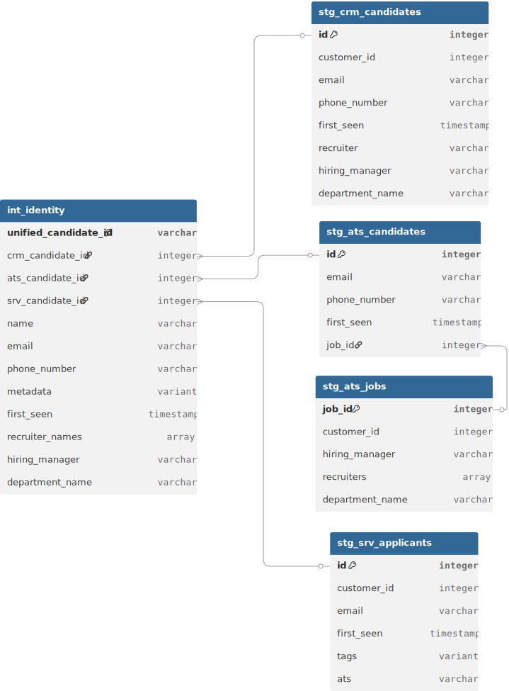
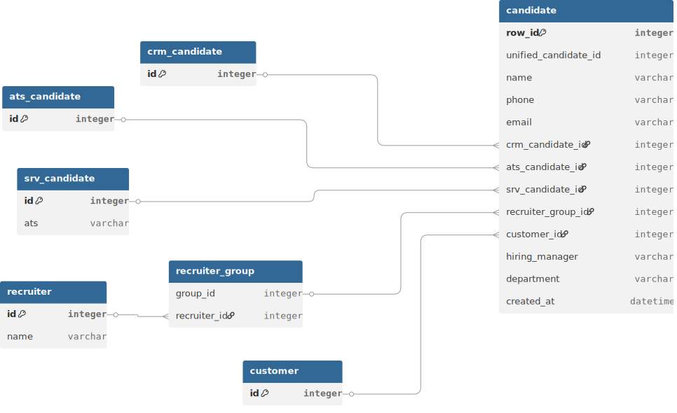

# Jobylon data engineer assignment project

This dbt project unifies candidate data from various source systems into a single, consolidated view.

## Models

The project is organized into two main model layers:

### Staging models

- **`stg_ats_candidates`**: Cleans and prepares candidate data from the ATS.
- **`stg_ats_jobs`**: Cleans and prepares job data from the ATS.
- **`stg_crm_candidates`**: Cleans and prepares candidate data from the CRM.
- **`stg_srv_applicants`**: Cleans and prepares applicant data from the SRV system.

### Intermediate Model

- **`int_identity`**: Merges the staging models to create a unified view of each candidate.

## Testing

The project includes data tests to ensure data quality and integrity. These tests are defined in the `schema.yml` files within the `models` directory.

## Design and assumptions

This is the diagram for the data model:

### Data modeling decisions

- Each data source has its own staging model for cleaning and standardization. This makes debbuging easier and give us modularity.
- The `int_identity` model consolidates data from the staging layers into a unified candidate view.
- A unique `unified_candidate_id` is generated for each candidate using a hash of their email, ensuring a consistent identifier across systems.
- In the `int_identity` model we have the metadata column. This is where all system-specific fields will be. This helps us to not having to modify the table when we need to incorporate new specific fields.
- For recruiters, I have decided to use a VARIANT type in order to keep as much information as we can.
- For tags, I have converted it to json and extracted the data we needed.

### Assumptions
- The database we are using is snowflake. This helps the data modeling because we can use the `VARIANT` and the `ARRAY` type.
- When values don't match between systems, we use a priority method `crm -> ats -> srv`.
- In order to add new fields/filters, if they are common, I would add them to the intermediate table. If they are system-specific, I would add it to the metadata column. It could also be cosidered to just add them to the metadata table if changing the table columns is a problem.
- We will only have 1 hiring manager and 1 department for each candidate.
- email will never be null in source systems. If this happened we wouldn't have any way of identifying the candidates, because phone isn't present in all systems.
- I have assumed that SRV is some kind of HR platform, althought I am not sure.
- I havent tested the code. I assume it works.
- dbt utils is installed.

## Future work
- Add better/more advance tests.
- Add type constraints.
- Ask lots of questions like how/where is this model going to be used, are we going to add more sources, etc.
- Create a real star schema. Right now we just have a unified table, but I think the correct approach would be to create all the dimensions with a kind of fact table being candidates. A possible schema would be something like:

## Example queries

The examples queries can be found in `analyses/example_queries.sql`